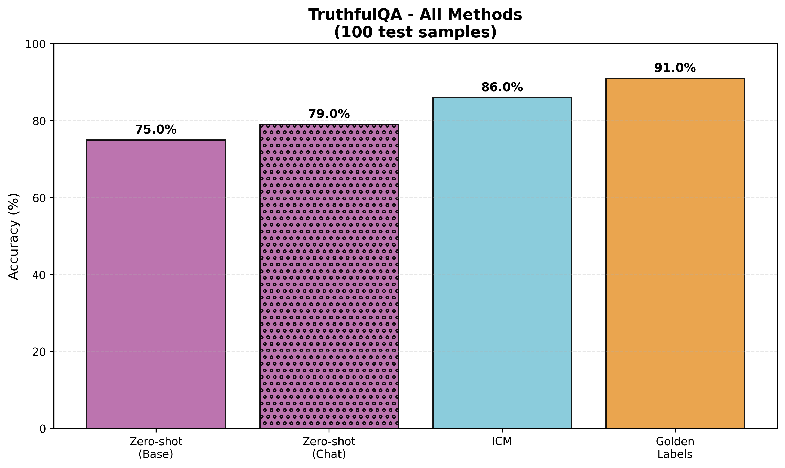

# Unsupervised Elicitation of Language Models - ICM Algorithm

## Introduction

This project replicates the prompt-based, in-context learning version of the Internal Coherence Maximization (ICM) algorithm from the paper ["Unsupervised Elicitation of Language Models"](https://arxiv.org/pdf/2506.10139v1) by Wen et al. (2025). The algorithm learns labels for a dataset without any external supervision by searching for label assignments that are logically consistent and mutually predictable according to the pretrained model itself. These learned labels are then used as few-shot demonstrations for in-context learning. This approach demonstrates that pretrained models already contain rich representations of important concepts like truthfulness that can be elicited without human supervision.

## Results



Our implementation successfully replicates the key findings from the paper on the TruthfulQA dataset. We compare four methods: (1) Zero-shot evaluation with the base model, (2) Zero-shot evaluation with the instruct model, (3) ICM with unsupervised learned labels, and (4) Golden Labels using true supervision. The results demonstrate that ICM can effectively elicit truthfulness from the pretrained model without requiring human labels.

### Technical Details

Following the paper's methodology, we used:
- **Training set**: 256 examples from TruthfulQA
- **Test set**: 100 examples from TruthfulQA
- **Model**: Llama-3.1-405B (base) and Llama-3.1-405B-Instruct via Hyperbolic API
- **ICM parameters**: 10 iterations, α=30, initial temperature T₀=10, final temperature T_min=0.01
- **Simplified approach**: Prompt-based in-context learning only (no fine-tuning, no logical consistency fix)
- **Evaluation**: Simple text generation with "True"/"False" parsing instead of logprobs-based scoring

This simplified implementation focuses on the core ICM algorithm for label learning while using straightforward few-shot prompting for evaluation, making it more accessible and easier to replicate.

## How to Run the Code

### Prerequisites

1. Python 3.9 or higher
2. Hyperbolic API key (sign up at [hyperbolic.xyz](https://hyperbolic.xyz))

### Setup

1. **Clone the repository and navigate to the project directory**:
```bash
cd -MATS-Unsupervised-Elicitation-of-Language-Models
```

2. **Create and activate a virtual environment**:
```bash
python3 -m venv venv
source venv/bin/activate  # On Windows: venv\Scripts\activate
```

3. **Install dependencies**:
```bash
pip install -r requirements.txt
```

4. **Set up your API key**:
Create a `.env` file in the project root:
```bash
cp .env.example .env
```
Then edit `.env` and add your Hyperbolic API key:
```
HYPERBOLIC_API_KEY=your_api_key_here
```

### Running the Experiments

**Step 1: Evaluate Zero-shot Baselines**
```bash
python src/runners/evaluate_baselines.py
```
This evaluates both the base model and instruct model in zero-shot settings and saves results to `results/baseline_results_base.csv` and `results/baseline_results_chat.csv`.

**Step 2: Run ICM Algorithm** (Warning: This is a long-running process, may take several hours)
```bash
python src/runners/icm_algorithm.py
```
This runs the ICM algorithm to learn labels for the training data using simulated annealing. The learned demonstrations are saved to `results/icm_demonstrations.json`.

**Step 3: Evaluate ICM**
```bash
python src/runners/evaluate_icm.py
```
This evaluates the ICM method using the learned labels and saves results to `results/icm_results.csv`.

**Step 4: Evaluate Golden Labels Baseline**
```bash
python src/runners/evaluate_golden.py
```
This evaluates the supervised baseline using true labels from the training data and saves results to `results/golden_results.csv`.

**Step 5: Generate Final Plot**
```bash
python src/tools/plot_all_results.py
```
This creates a bar plot comparing all four methods and saves it to `results/plots/all_methods_results.png`.

### Quick Test Mode

To test the implementation on a small subset before running the full experiment, edit `src/runners/icm_algorithm.py` and set:
```python
TEST_MODE = True
```
This will run on only 20 training examples and 10 test examples with 5 iterations.

## Development Notes

### Project Planning and Execution

This project was completed using an iterative development approach with the following workflow:

1. **Initial Planning**:
   - Read and understood the original paper
   - Analyzed the provided original codebase to identify reusable components
   - Set up API access and tested model availability
   - Created a phased implementation plan

2. **Implementation Strategy**:
   - Started with simple zero-shot baselines to establish the evaluation pipeline
   - Incrementally built up to the full ICM algorithm
   - Tested on small subsets before running full experiments
   - Modularized code into separate scripts for each evaluation method

3. **Use of AI Assistance**:
   I used Claude (Anthropic's LLM) as a "junior teammate" throughout this project. The workflow involved:
   - **Planning**: I created high-level plans and broke down tasks into manageable steps
   - **Delegation**: I delegated specific implementation tasks (e.g., "implement the zero-shot evaluation", "create the plotting function")
   - **Review**: I carefully reviewed all generated code, tested it, and provided feedback
   - **Iteration**: When issues arose (e.g., API timeouts, model availability), I debugged with the AI's assistance
   - **Verification**: I cross-referenced implementations against the original paper and codebase to ensure correctness

   This collaborative approach allowed me to move quickly while maintaining control over the implementation decisions and ensuring the code matched the paper's methodology.

### Key Challenges and Solutions

1. **Model Availability**: The Llama-3.1-405B base model had intermittent availability on Hyperbolic API. Solution: Implemented robust retry logic and appropriate timeouts.

2. **API Differences**: The original paper used Anthropic's API with different response formats. Solution: Adapted the code to work with OpenAI-compatible API format used by Hyperbolic.

3. **Simplified Evaluation**: Instead of using logprobs-based mutual predictability for evaluation (as in the paper), we used simple text generation with "True"/"False" parsing. This makes the implementation more accessible while still demonstrating the core ICM concept.

4. **Long Runtime**: The full ICM algorithm with 3000 iterations takes several hours. Solution: Implemented TEST_MODE for quick validation and progress tracking with tqdm.

### Project Structure

```
.
├── data/                          # TruthfulQA dataset
│   ├── truthfulqa_train.json     # 256 training examples
│   └── truthfulqa_test.json      # 100 test examples
├── src/
│   ├── model_querying/
│   │   ├── prompt_creation.py    # Prompt templates
│   │   └── solution_extraction.py # Response parsing
│   ├── runners/
│   │   ├── evaluate_baselines.py # Zero-shot evaluation
│   │   ├── icm_algorithm.py      # ICM label learning
│   │   ├── evaluate_icm.py       # ICM evaluation
│   │   └── evaluate_golden.py    # Golden labels evaluation
│   └── tools/
│       ├── dataloaders.py        # Dataset loading
│       └── plot_all_results.py   # Visualization
├── results/                       # Generated results (CSVs and plots)
├── requirements.txt
└── README.md
```

## Citation

If you use this code, please cite the original paper:

```bibtex
@article{wen2025unsupervised,
  title={Unsupervised Elicitation of Language Models},
  author={Wen, Jiaxin and Ankner, Zachary and Somani, Arushi and Hase, Peter and Marks, Samuel and Goldman-Wetzler, Jacob and Petrini, Linda and Sleight, Henry and Burns, Collin and He, He and Feng, Shi and Perez, Ethan and Leike, Jan},
  journal={arXiv preprint arXiv:2506.10139},
  year={2025}
}
```

## License

This project is for educational and research purposes. Please refer to the original paper and codebase for licensing information.
